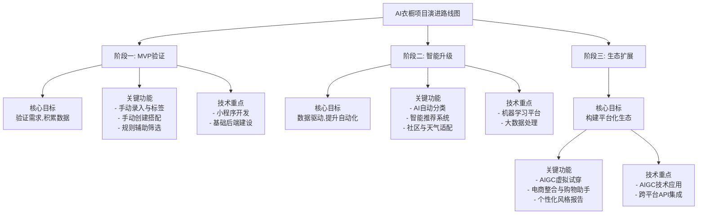

# AI衣橱助手（智能衣物管理与搭配）产品需求说明文档

## 核心价值主张
通过人工智能技术，简化用户衣橱管理流程，并提供个性化、数据驱动的穿搭建议，帮助用户节省时间、提升形象。

## 项目实施路线图
项目分为三个阶段实施，从最小可行产品到平台化生态构建，实现技术和业务的逐步升级。

## 阶段一：MVP (最小可行产品) - 验证核心逻辑与积累数据

### 目标
快速上线一个可用的基础产品，验证市场需求，并开始积累最宝贵的资产——**用户数据**。

### 时间预估
2-4个月

### 核心功能细节

1. **基础衣橱管理（手动为主）**：
   * **衣物录入**：
     * 用户通过小程序拍照或从相册选择图片。
     * **手动标签系统**：提供必须选择的分类下拉菜单（如：上衣、下装、鞋履、配饰）、颜色选择器、季节标签、场合标签（商务、休闲、运动等）。这是结构化数据的基础。
     * **UI/UX设计**：将标签选择过程设计得尽可能流畅，如大面积图标化选择，减少用户输入负担。
   * **衣橱视图**：提供"列表"和"网格"两种方式查看所有衣物，并支持按手动选择的标签（如"所有上衣"、"所有蓝色物品"）进行筛选。

2. **搭配功能（手动）**：
   * **创建搭配**：用户可以从衣橱中拖拽或选择多件物品（如上衣、下装、鞋子），组合成一个"穿搭方案"，并为其命名（如"一周通勤Look"）。
   * **搭配集合**：提供一个"我的搭配"页面，以卡片形式展示用户自己创建的所有穿搭方案。

3. **"半自动"推荐（规则引擎雏形）**：
   * **功能点**：在用户手动创建搭配时，实现一个 **"智能筛选"** 功能。
   * **实现方式**：编写少量核心规则。
     * **颜色规则**：当用户选中一件蓝色上衣时，筛选器自动高亮或优先显示衣橱中符合"互补色"（如橙色）或"中性色"（如白、黑、灰）的下装。
     * **类别规则**：选中上衣后，筛选器主要显示下装和鞋履，隐藏其他上衣。
   * **体验**：这给了用户一种"辅助"的感觉，而非全自动，心理预期管理得更好。

### 技术实现

* **前端**：微信小程序原生开发。
* **后端**：Node.js/Python + MySQL/MongoDB。数据库设计要合理，尤其是物品（items）和搭配（outfits）的关系。
* **AI**：**暂不投入复杂AI**。可尝试调用一次腾讯云OCR或通用物品识别API，将其结果作为标签的**默认预填值**（用户可修改），作为技术预研和体验优化。

### 成功标准

* 用户增长率、活跃度。
* **核心指标**：平均每个用户上传的衣物数量、创建的搭配数量。这表明用户是否认为产品有用。
* 用户反馈：通过内置问卷或用户访谈，收集对"智能筛选"功能的感受。

## 阶段二：增长与优化 - 数据驱动与智能化升级

### 目标
利用阶段一积累的数据，引入真正的AI能力，提升分类自动化程度和搭配的智能化、个性化水平，增强用户粘性。

### 时间预估
4-8个月

### 核心功能细节

1. **强化自动分类（AI赋能）**：
   * **模型建立**：利用阶段一积累的**用户已标注的图片数据**（这是黄金训练集），开始训练专属的服饰分类模型（使用TensorFlow/PyTorch）。初期可专注于最核心的"大类"识别（如T恤、衬衫、牛仔裤）。
   * **功能迭代**：
     * **V1.0**：用户上传图片后，AI模型自动预测一个类别并预填，准确率可能只有80%，仍需用户确认。
     * **V2.0**：随着模型优化和数据增多，准确率提升至95%以上，并可预测更多属性（如领型、袖长、图案），用户体验实现质的飞跃。

2. **智能推荐系统（核心智能）**：
   * **数据引擎**：
     * **显性数据**：用户最终采纳的搭配方案是最直接的正面样本。
     * **隐性数据**：用户在"推荐搭配"页面的停留时间、点击、保存等行为数据。
   * **推荐逻辑**：
     * **协同过滤**：发现与你有着相似衣橱和品味偏好（"相似用户"）的其他用户，他们创建的搭配方案可能会推荐给你。
     * **基于内容的推荐**：分析你衣橱中单品的属性（颜色、款式等），根据规则和机器学习模型，为你组合新的搭配。
   * **功能呈现**：新增一个 **"每日推荐"** 或 **"灵感"** 标签页，每天为用户生成若干套基于其衣橱的搭配方案。方案需注明"根据你的蓝色衬衫和白色牛仔裤生成"。

3. **社交与场景化功能（促活增长）**：
   * **社区分享**：用户可以选择将自己创建的搭配或AI生成的搭配分享到小程序内的广场，他人可以点赞、收藏。这既是UGC，也是强大的冷启动推荐数据来源。
   * **天气适配**：接入天气API，在推荐搭配时优先推荐适合当日气温和天气的衣物。

### 技术实现

* **后端**：需要引入大数据处理框架（如Spark用于推荐算法）和模型服务化（Model Serving）。
* **AI平台**：搭建独立的机器学习平台，用于数据的清洗、标注、模型训练和部署。
* **数据库**：可能需要引入图数据库（如Neo4j）来高效处理用户和物品之间的复杂关系，优化推荐性能。

### 成功标准

* **AI准确率**：自动分类的准确率和召回率。
* **推荐采纳率**：用户采纳AI生成搭配的比例。
* **用户留存率**：因为智能化功能，用户的次日、7日留存率是否有显著提升。

## 阶段三：深化与扩展 - 平台化与生态构建

### 目标
从工具型应用演进为平台型生态，拓展商业模式，构建竞争壁垒。

### 时间预估
8个月以上

### 核心功能细节

1. **AIGC虚拟试穿（技术前沿）**：
   * 与专业的AIGC算法团队合作，尝试实现**虚拟穿搭生成**。
   * 用户上传一件新买的衣服，AI可以将其"穿"在虚拟模特（或用户自己的头像）身上，并搭配其衣库中的其他单品生成整体look预览。这是体验上的颠覆性升级。

2. **电商与商业化闭环**：
   * **购物助手**：与电商平台合作，提供API接口。当用户想买新衣服时，可以拍照搜索同款或类似款，更重要的是，AI可以判断这件新衣服是否与用户衣橱中现有衣物能搭配出至少3套方案，提供"智能购物决策"。
   * **品牌合作**：与服装品牌合作，将其商品库接入你的AI搭配系统，用户可以直接看到一件品牌上衣与自己衣橱的搭配效果，并直接跳转购买。

3. **个性化风格引擎**：
   * 通过长期的数据积累，AI可以为用户生成一份**个人风格报告**：分析用户的色彩偏好、风格倾向（如复古、极简）、衣物使用率等。
   * 提供更高级的定制服务，如"衣橱胶囊"（Capsule Wardrobe）生成、定制化购物推荐等。

### 技术实现

* **跨领域合作**：需要与AIGC研究机构、电商平台、品牌方进行深度技术对接和商务合作。
* **技术架构**：微服务架构彻底升级，以应对复杂的业务场景和高并发需求。

### 成功标准

* 商业收入（广告、佣金、增值服务）。
* 平台GMV（如果走电商模式）。
* 成为垂直领域的头部应用，建立品牌认知。

## 项目实施建议
**阶段一是基石**，务必扎实。最大的风险是一开始就试图实现阶段三的功能，那会导致项目复杂度过高而失败。步步为营，小步快跑，是这个项目成功的关键。